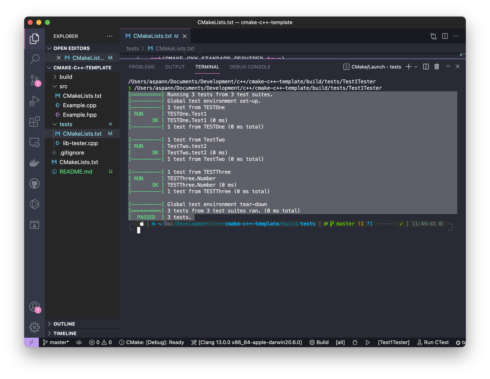

# Objective

This is a **BAREBONES** *C++* template with *Google Test* support using *CMake*. It is setup to allow for the building of a *static* library using **TDD** principles; but could be adapted for building a small program. This is in no way the ideal solution.

This template was created to allow for programming under *Mac OS*. But the files should work under other systems.

## Directory Structure

This is the structure that we start with. It should be noted that the **build** directory will be generated in the root of this structure under *VSCode*. This appears, to generally be discouraged and can be changed with some configuration options that I will not go into here.

```sh
❯ tree .
.
├── CMakeLists.txt
├── README.md
├── src
│   ├── CMakeLists.txt
│   ├── Example.cpp
│   └── Example.hpp
└── tests
    ├── CMakeLists.txt
    └── lib-tester.cpp

```

## Requirements

You will require the following items to be installed. Note that I have used **homebrew** in order to source the requirements. If you are not using *Mac OS* you should be able to find other ways to install the requirements. Google Search will be your friend in this.

#### CMake

##### Installation

```sh
brew install cmake
```

#### Google Test

#### Installation

```sh
brew install googletest
```

## Example Execution

Let's build the code in and *Out of Source* build folder.

```sh
❯ cmake -B /tmp/testing -S .
-- The CXX compiler identification is AppleClang 13.0.0.13000029
-- Detecting CXX compiler ABI info
-- Detecting CXX compiler ABI info - done
-- Check for working CXX compiler: /Applications/Xcode.app/Contents/Developer/Toolchains/XcodeDefault.xctoolchain/usr/bin/c++ - skipped
-- Detecting CXX compile features
-- Detecting CXX compile features - done
-- Found GTest: /usr/local/lib/cmake/GTest/GTestConfig.cmake (found version "1.11.0")  
-- Configuring done
-- Generating done
-- Build files have been written to: /tmp/testing
```

Let's compile the code

```sh
❯ cd /tmp/testing
❯ ls
CMakeCache.txt      CTestTestfile.cmake cmake_install.cmake tests
CMakeFiles          Makefile            src
❯ make
[ 25%] Building CXX object src/CMakeFiles/mylib.dir/EXample.cpp.o
[ 50%] Linking CXX static library libmylib.a
[ 50%] Built target mylib
[ 75%] Building CXX object tests/CMakeFiles/Test1Tester.dir/lib-tester.cpp.o
[100%] Linking CXX executable Test1Tester
[100%] Built target Test1Tester
```

Things to note: The generated *static library* will be called **libmylib.a** and its name comes from the **project** variable in the top level *CMakeList.txt* file.

## CMakeList.txt Contents

### Root

```txt
cmake_minimum_required(VERSION 3.22)
project(mylib
        VERSION 0.1.0.0
        DESCRIPTION "What does it do?"
        LANGUAGES CXX
        )

set(CMAKE_CXX_STANDARD 14)
set(CMAKE_CXX_STANDARD_REQUIRED true)
set(CMAKE_POSTION_INDEPENDENT_CODE ON)

enable_testing()

add_subdirectory(src)
add_subdirectory(tests)
```

The *project* label here is being used to set several variables.

- `mylib` This is used to set the library's name -> `libmylib.a`
- `enable_testing()` This is used to enable to testing within the IDE
- `add_subdirectory()` This makes the top level aware of the sub-directories. `src` is the code source of the library. And `tests` is where the source code for the testing code will be written.

## src

```txt
set(LIB_BINARY ${CMAKE_PROJECT_NAME})

set(headers
    Example.hpp)
set(sources
    EXample.cpp)
set(SOURCES ${headers} ${sources})

add_library(${LIB_BINARY} STATIC ${SOURCES})
target_include_directories( ${LIB_BINARY} PUBLIC ${CMAKE_CURRENT_SOURCE_DIR})
```

- `LIB_BINARY` This stores the name of the library to be generated. Coming from *project* which was set in the previous *CMakeList.txt* covered earlier.
- `headers` This will contain references to any and all header files that are need to compile the library.
- `sources` This will contain references to any source files that are needed.
- `SOURCES` This combines `headers` and `sources`
- `add_library` This tells *cmake* that we are declaring we want to generate a library file and not an executable. We also specifiy that it is to be a **Static** and not **dynamic** library.
- `target_include_directories` this tells *cmake* that we should:
  - build a library named `lib{LIB_BINARY}.a`
  - This directory's contents should be made available to other directories in the main project. This means we will be able to build the test programs using this new library.

### tests

```txt
cmake_minimum_required(VERSION 3.22)

set(CMAKE_CXX_STANDARD 14)
set(CMAKE_CXX_STANDARD_REQUIRED true)
set(CMAKE_POSTION_INDEPENDENT_CODE ON)

file(GLOB_RECURSE TEST_SOURCES LIST_DIRECTORIES false *.hpp *.cpp)

set(test1 Test1Tester)
set(test1src lib-tester.cpp)

# Specify second test program and source files
#set(test2 Test2Tester)
#set(test2src lib-tester2.cpp)

add_executable(${test1} ${test1src})

# Specify executable for second tester
#add_executable(${test2} ${test2src})

find_package( GTest REQUIRED )      
# adds the gtest include directory
include_directories( ${GTEST_INCLUDE_DIRS} )
# links gtest
target_link_libraries( ${test1} LINK_PUBLIC ${GTEST_LIBRARIES} ${CMAKE_PROJECT_NAME})

# Specify target for second test program
#target_link_libraries( ${test2} LINK_PUBLIC ${GTEST_LIBRARIES} ${CMAKE_PROJECT_NAME})

enable_testing()
add_test(
   NAME ${test1}}
   COMMAND ${test1}
)
```

- `file` This another way to get gather the files for compiling. Though it is discouraged.
- `test1` This will hold the name of the testing executable.
- `test1src` This holds the name of the source file to be used to build the test executable.
- `add_executable` This is the executable to be compiled as the test program

We also need to ensure that we can link in the *GTest* library. We do that with the following commands.

```txt
find_package( GTest REQUIRED )      
# adds the gtest include directory
include_directories( ${GTEST_INCLUDE_DIRS} )

```

- This locates the *Google Test* libraries that were installed earlier.

Linking the everything together so we have an executable that tests our code.

```txt
target_link_libraries( ${test1} LINK_PUBLIC ${GTEST_LIBRARIES} ${CMAKE_PROJECT_NAME})
```

- This creates the executable, linking the *GTEST* library and the `mylib` library

If you look through you will see that I have commented out a *second* source and executable. It is possible to build several test programs. This allows you to build different tests programs instead of having one single monalithic test application.


## Screen Capture

